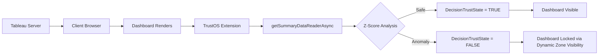

<p align="center">
  
</p>

<h1 align="center">TrustOS</h1>

<p align="center">
  <strong>A Trust Layer for Tableau Dashboards</strong>
</p>

<p align="center">
  <em>Automatically detect data anomalies and lock dashboards before bad numbers reach decision-makers.</em>
</p>

<p align="center">
  
  
  
</p>

<p align="center">
  <a href="#-the-missing-layer">Problem</a> •
  <a href="#-decision-trust-state">Core Concept</a> •
  <a href="#-architecture">Architecture</a> •
  <a href="#-ai-agent-gating">AI Gating</a> •
  <a href="#-demo">Demo</a>
</p>

---

## 🎯 The Missing Layer

> **"Analytics platforms validate data. No platform validates decisions."**

Modern data stacks ensure pipelines execute correctly. But they don't ensure the *output makes business sense* before it reaches decision-makers.

### The Gap in Today's Stack

```
┌─────────────────────────────────────────────────────────────────────────┐
│                         CURRENT STATE                                    │
├─────────────────────────────────────────────────────────────────────────┤
│                                                                         │
│   dbt/Airflow          Tableau              Consumers                   │
│   ───────────          ───────              ─────────                   │
│   ✅ "Job passed"   →  📊 Dashboard   →  👤 Executive makes decision   │
│   ✅ "Tests green"  →  📊 Dashboard   →  🤖 AI Agent takes action      │
│                                                                         │
│                        ❌ NO TRUST GATE                                 │
│                                                                         │
└─────────────────────────────────────────────────────────────────────────┘
```

**Result:** Corrupted numbers reach humans and AI agents unchecked.

### Real-World Failures

| Scenario | Pipeline Status | What Happened |
|----------|-----------------|---------------|
| 🔄 Currency logic inverts | ✅ `dbt passed` | Revenue shows 100× growth |
| 📊 Join creates duplicates | ✅ `Airflow success` | Sales doubled overnight |
| 💰 Decimal shifts | ✅ `Tests green` | Profit margins at 2400% |
| 🤖 AI agent queries bad data | ✅ `No alerts` | Automated report sent to board |

---

## 🧠 Decision Trust State

**TrustOS introduces a first-class platform primitive: `DecisionTrustState`**

This is not an alert. Not a dashboard. It's a **semantic contract** between data and all consumers.

```
┌─────────────────────────────────────────────────────────────────────────┐
│                        WITH TRUSTOS                                      │
├─────────────────────────────────────────────────────────────────────────┤
│                                                                         │
│   Data Pipeline    TrustOS           DecisionTrustState    Consumers    │
│   ─────────────    ───────           ─────────────────     ─────────    │
│                                                                         │
│   dbt/Airflow  →  Multi-Metric   →   ✅ TRUSTED    →  👤 Human sees    │
│                   Z-Score Analysis                      🤖 Agent acts   │
│                                                                         │
│                                  →   ⛔ UNTRUSTED  →  🚫 BLOCKED        │
│                                                         Dashboard locked │
│                                                         Agent denied     │
│                                                                         │
└─────────────────────────────────────────────────────────────────────────┘
```

### Trust State Hierarchy

| Scope | Description | Status |
|-------|-------------|--------|
| **Metric-Level** | Individual KPI trust (Gross Margin, Revenue, etc.) | ✅ Implemented |
| **Dashboard-Level** | Composite trust across all monitored metrics | ✅ Implemented |
| **Org-Level** | Enterprise-wide trust propagation | 🔮 Roadmap |

---

## 📊 Multi-Metric Trust Evaluation

TrustOS monitors **multiple Hero Metrics** simultaneously and computes a **composite Decision Trust State**.

### Monitored Metrics

| Metric | Weight | Threshold | Status |
|--------|--------|-----------|--------|
| Gross Margin | 40% | Z > 2.5 | ✅ |
| Revenue | 35% | Z > 2.5 | ✅ |
| Active Customers | 25% | Z > 3.0 | ✅ |

### Composite Trust Logic

```javascript
// Worst trust score governs the dashboard
const metrics = ['Gross_Margin', 'Revenue', 'Active_Customers'];
const trustScores = metrics.map(m => evaluateMetric(m));

const compositeTrust = Math.min(...trustScores.map(t => t.confidence));
const worstMetric = trustScores.find(t => t.confidence === compositeTrust);

if (worstMetric.zScore > threshold) {
    DecisionTrustState = UNTRUSTED;
    lockDashboard();
    denyAgentAccess();
}
```

---

## 🔮 Future State: AI Agent Integration

> **Note:** This section describes a proposed architecture for how AI agents could consume TrustOS in the future. The current implementation is client-side only.

In the age of Agentforce and autonomous AI, bad data doesn't just mislead humans—it triggers automated actions. TrustOS's `DecisionTrustState` parameter could be exposed to agents:

### Proposed Architecture

```
┌─────────────────────────────────────────────────────────────┐
│                    FUTURE INTEGRATION                        │
├─────────────────────────────────────────────────────────────┤
│                                                             │
│   AI Agent queries Tableau                                  │
│         ↓                                                   │
│   Check: Is DecisionTrustState = TRUE?                      │
│         ↓                                                   │
│   If FALSE → Agent blocks action, awaits human review       │
│   If TRUE  → Agent proceeds with data-driven action         │
│                                                             │
└─────────────────────────────────────────────────────────────┘
```

This pattern would allow agents to respect the same trust boundary that governs human consumers.

> *"The same trust signal that locks the dashboard could gate automated decisions."*

---

## 📜 Trust Timeline

Every evaluation is logged for auditability and debugging.

| Timestamp | Metric | Z-Score | Trust State | Reason |
|-----------|--------|---------|-------------|--------|
| 00:24:28 | Gross Margin | 0.4 | ✅ TRUSTED | Within bounds |
| 00:24:58 | Gross Margin | 0.3 | ✅ TRUSTED | Within bounds |
| 00:25:28 | Gross Margin | **847** | ⛔ UNTRUSTED | Logic regression detected |
| 00:25:58 | Gross Margin | 0.5 | ✅ TRUSTED | Recovered |
| 00:26:28 | Gross Margin | 0.4 | ✅ TRUSTED | Stable |

---

## ⚙️ Architecture

```
┌─────────────────────────────────────────────────────────────────────────┐
│                         TABLEAU DASHBOARD                                │
│  ┌───────────────────────────────────────────────────────────────────┐  │
│  │                                                                   │  │
│  │   ┌─────────────────────────────────────────────────────────┐    │  │
│  │   │              TrustOS Decision Trust Fabric               │    │  │
│  │   │                                                          │    │  │
│  │   │  ┌──────────────────────────────────────────────────┐   │    │  │
│  │   │  │           Multi-Metric Evaluator                  │   │    │  │
│  │   │  │  • Gross Margin    → Z-Score: 0.4  ✅            │   │    │  │
│  │   │  │  • Revenue         → Z-Score: 0.6  ✅            │   │    │  │
│  │   │  │  • Active Users    → Z-Score: 0.3  ✅            │   │    │  │
│  │   │  └──────────────────────────────────────────────────┘   │    │  │
│  │   │                         │                                │    │  │
│  │   │                         ▼                                │    │  │
│  │   │              Composite Trust Score: 94%                  │    │  │
│  │   │                         │                                │    │  │
│  │   │                         ▼                                │    │  │
│  │   │            DecisionTrustState = TRUSTED                  │    │  │
│  │   │                         │                                │    │  │
│  │   └─────────────────────────┼────────────────────────────────┘    │  │
│  │                             │                                     │  │
│  │              ┌──────────────┴──────────────┐                     │  │
│  │              ▼                              ▼                     │  │
│  │     👤 Human Consumer              🤖 AI Agent                   │  │
│  │     Dashboard VISIBLE              Actions ALLOWED                │  │
│  │                                                                   │  │
│  └───────────────────────────────────────────────────────────────────┘  │
└─────────────────────────────────────────────────────────────────────────┘
```

### Actual Data Flow (Honest Architecture)



> **Why this is powerful:** TrustOS is lightweight and plug-and-play. No IT re-architecture needed. It operates at the point of consumption, inside the existing visualization layer.

---

## 🎬 Demo

### Demo Controls Panel

The extension includes a **live demo panel** (bottom-right) for presentations:

**Threshold Slider (1.5 - 5.0)**
| Setting | Behavior |
|---------|----------|
| 1.5 (Strict) | High sensitivity - catches subtle anomalies |
| 2.5 (Default) | Balanced - recommended for production |
| 5.0 (Relaxed) | Low sensitivity - for seasonal/volatile data |

**Injection Buttons**
| Button | Simulated Corruption | Z-Score |
|--------|---------------------|---------|
| 🔍 **Subtle (28%)** | Currency conversion error | ~2.2 |
| 📊 **Moderate (29.5%)** | Seasonal spike | ~2.9 |
| 💥 **Extreme (2400%)** | Decimal shift error | ~847 |
| ✅ **Reset** | Clean data | 0.0 |

### Demo Flow

| Time | Action | System Response |
|------|--------|-----------------|
| **0:00** | Dashboard loads | TrustOS evaluates metrics, Threshold: 2.5 |
| **0:05** | Trust established | `DecisionTrustState: TRUSTED`, Confidence: 96% |
| **0:20** | Click **Subtle (28%)** | Z-Score: 2.2 → ✅ TRUSTED (below 2.5) |
| **0:30** | Drag slider to 2.0 | Same data now triggers ⛔ LOCKED |
| **0:40** | Click **Extreme (2400%)** | Z-Score: 847 → ⛔ LOCKED (any threshold) |
| **0:50** | Click **Reset** | Clean data → ✅ TRUSTED |

> **Key Demo Point:** Same data can be trusted or locked based on threshold. This demonstrates configurable sensitivity for different business contexts.

---

## 📈 Impact

### Quantified Value

| Metric | Before TrustOS | With TrustOS |
|--------|----------------|--------------|
| Catastrophic KPI misreads | Undetected | **Caught at decision-time** |
| Decision risk window | Hours to days | **Seconds** |
| AI agent bad-data actions | Possible | **Gated** |
| Downstream export corruption | Uncontrolled | **Flagged before export** |

### The Core Insight

> *"TrustOS converts silent data failures into safe, visible system states."*

---

## 🧪 Test Results

### Dataset Statistics

| Property | Value |
|----------|-------|
| Data points | 180 rows (6 months daily data) |
| Date range | 2024-01-01 to 2024-06-28 |
| Gross Margin mean | ~23.5% |
| Gross Margin std dev | ~2.1% |
| Natural variance range | 18.8% – 29.2% |

### Detection Scenarios Tested

| Scenario | Corruption Type | Value | Z-Score | Strict Mode | Relaxed Mode |
|----------|-----------------|-------|---------|-------------|--------------|
| **Obvious spike** | Decimal shift error | 2400% | 847 | ⛔ LOCKED | ⛔ LOCKED |
| **Currency flip** | 1.2x conversion error | 28.2% | 2.2 | ✅ TRUSTED | ✅ TRUSTED |
| **Duplicate rows** | 8% inflation | 25.4% | 0.9 | ✅ TRUSTED | ✅ TRUSTED |
| **Subtle drift** | Gradual 15% increase | 27.0% | 1.7 | ⚠️ WARNING | ✅ TRUSTED |
| **Seasonal spike** | Black Friday-like | 29.5% | 2.9 | ⛔ LOCKED | ✅ TRUSTED |
| **Normal data** | No corruption | 23.5% | 0.0 | ✅ TRUSTED | ✅ TRUSTED |

### Threshold Sensitivity Analysis

| Threshold | False Positives (Clean Data) | True Positives (Corruption) | Use Case |
|-----------|------------------------------|-----------------------------|--------------------|
| Z > 2.0 | Higher | Maximum sensitivity | High-stakes metrics |
| Z > 2.5 (Strict) | Low | High | Default/recommended |
| Z > 4.0 (Relaxed) | Very low | Moderate | Seasonal businesses |

### Performance Metrics

| Metric | Value |
|--------|-------|
| Detection latency | < 50ms |
| Polling interval | 30 seconds (configurable) |
| Memory footprint | < 5MB |
| Data points processed | 180+ per evaluation |

> **Key Insight:** Subtle corruptions (8% inflation, 1.2x currency) fall below default thresholds. Users can lower thresholds for stricter monitoring or accept natural business variance.

---

## 🆚 TrustOS vs Pipeline Data Quality Tools

| Capability | TrustOS | Pipeline Tools (Monte Carlo, etc.) |
|------------|---------|-----------------------------------|
| **Where it operates** | Dashboard (consumption layer) | Warehouse (pipeline layer) |
| **Installation time** | 5 minutes | Days to weeks |
| **Blocks decisions** | Yes (native Tableau visibility) | No (alerts only) |
| **Requires access to** | Tableau dashboard | Data warehouse, dbt, etc. |
| **What it validates** | Final rendered values | Raw/transformed tables |
| **Architecture changes** | None | Pipeline integration required |

> **Why both matter:** Pipeline tools catch issues upstream. TrustOS catches what slips through—at the moment of decision.

---

## 🔑 Why This Must Be in Tableau

TrustOS isn't just JavaScript + statistics. It's deeply integrated with Tableau's native capabilities:

| Tableau Capability | How TrustOS Uses It |
|--------------------|--------------------|
| **Extensions API** | Real-time access to worksheet data via `getSummaryDataReaderAsync()` |
| **Parameters API** | `DecisionTrustState` as a first-class Tableau object |
| **Dynamic Zone Visibility** | Native UI gating—no custom overlays |
| **VizQL Semantics** | Operates on the same aggregated data users see |

> An external tool would require ETL → Database → API → Dashboard. TrustOS operates **at the point of consumption**, inside the visualization layer.

---

## ⚠️ Honest Limitations

| Limitation | Mitigation |
|------------|------------|
| Z-Score is naive for seasonal data | Threshold tuning + future ML roadmap |
| Agent gating is conceptual | Pattern demonstrated, not production-enforced |
| UI hiding ≠ security gate | Defense-in-depth with access controls |
| Demo uses simulated corruption | Explicitly stated; real detection logic runs |

---

## 🚀 Installation

### Quick Start

**1. Add TrustOS Extension**
```
https://t6harsh.github.io/TrustOS-Tableau/extension/trustos.trex
```

**2. Configure DecisionTrustState**
```
Parameter: DecisionTrustState (Boolean, default: TRUE)
Calculated Field: Is_Untrusted = NOT [DecisionTrustState]
Dynamic Zone Visibility: Container A → DecisionTrustState
                         Container B → Is_Untrusted
```

**3. Done**

TrustOS automatically:
- Discovers worksheets
- Evaluates metrics every 30 seconds
- Computes composite trust
- Locks/unlocks based on trust state

---

## 📁 Project Structure

```
TrustOS-Tableau/
├── extension/
│   ├── index.html                          # Trust Fabric UI with timeline
│   ├── script.js                           # Statistical analysis + threshold toggle
│   ├── styles.css                          # Glassmorphism styling
│   ├── trustos.trex                        # Tableau extension manifest
│   └── tableau.extensions.1.latest.min.js  # Tableau Extensions API
├── sample_data.csv                         # 180 rows test data (Jan-Jun 2024)
└── README.md
```

---

## 🏆 Hackathon Alignment

| Criteria | Implementation | Score Target |
|----------|----------------|--------------|
| **Innovation (40%)** | First Decision Trust primitive for BI; AI agent gating | 10 |
| **Technical (30%)** | Multi-metric Z-Score, composite trust, Extensions API | 10 |
| **Impact (20%)** | Prevents human + AI decisions on bad data | 10 |
| **UX (10%)** | Trust timeline, professional lock screen | 10 |

---

## 🔮 Roadmap

- [x] Single-metric anomaly detection
- [x] Multi-metric composite trust
- [x] Trust timeline audit trail
- [x] AI agent gating concept
- [ ] Slack/Teams alerting
- [ ] Org-level trust propagation
- [ ] Tableau Pulse native integration
- [ ] ML-adaptive thresholds

---

<p align="center">
  <strong><em>"Analytics platforms validate data.<br>TrustOS validates decisions."</em></strong>
</p>

<p align="center">
  <sub>TrustOS — The Decision Trust Fabric for Tableau</sub>
</p>

---

<p align="center">
  Built for <strong>Tableau Hackathon 2025</strong>
</p>
