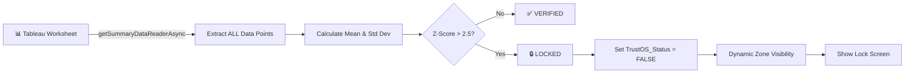

<p align="center">
  
</p>

<h1 align="center">TrustOS for Tableau</h1>

<p align="center">
  <strong>The "Check Engine Light" for Your Data Dashboard</strong>
</p>

<p align="center">
  <em>Stop executives from making million-dollar decisions on broken numbers.</em>
</p>

<p align="center">
  
  
  
  
</p>

<p align="center">
  <a href="#-the-problem">Problem</a> •
  <a href="#-the-solution">Solution</a> •
  <a href="#-how-it-works">How It Works</a> •
  <a href="#-demo">Demo</a> •
  <a href="#-installation">Installation</a>
</p>

---

## 🚨 The Problem

> **"The pipeline passed. The dashboard was wrong. The CFO quoted it in an earnings call."**

Modern data stacks validate whether pipelines *ran successfully*, not whether the output *makes business sense*.

### Real-World Disasters We Prevent

| Scenario | What Goes Wrong | Pipeline Status | Business Impact |
|----------|-----------------|-----------------|-----------------|
| 🔄 **Currency Flip** | Exchange rate logic inverts | ✅ `dbt passed` | Revenue shows 100x growth |
| � **Join Explosion** | Cartesian join creates duplicates | ✅ `Airflow success` | Sales doubled overnight |
| 🎯 **Filter Drop** | Production filter removed | ✅ `No alerts` | Churn looks artificially low |
| 💰 **Decimal Shift** | Cents become dollars | ✅ `Tests green` | Profit margins at 2400% |

**The data team checks if the job finished. No one checks if the number is sane.**

---

## 💡 The Solution

**TrustOS** is a Tableau Extension that acts as a real-time "circuit breaker" for your dashboards.

It monitors your **Hero Metrics** — the numbers that get people fired if they're wrong — and automatically **locks the dashboard** when something doesn't look right.

```
┌─────────────────────────────────────────────────────────────────┐
│                                                                 │
│    📊 Normal State                   🔒 Anomaly Detected        │
│    ━━━━━━━━━━━━━━━                   ━━━━━━━━━━━━━━━━━━━        │
│                                                                 │
│    ✓ Verified                        ⛔ DASHBOARD LOCKED        │
│    Gross Margin: 24.2%               Z-Score: 2,449             │
│    Z-Score: 0.4                      Confidence: 0%             │
│    Confidence: 96%                                              │
│                                      "Gross Margin at 2400%     │
│    [Dashboard Visible]                is outside safe bounds"   │
│                                                                 │
│                                      [Dashboard Hidden]         │
│                                      [Lock Screen Visible]      │
│                                                                 │
└─────────────────────────────────────────────────────────────────┘
```

---

## ⚙️ How It Works

TrustOS uses **real statistical analysis** on your actual worksheet data — not simulated values.

### Technical Flow



### The Math (Real Z-Score Calculation)

```javascript
// Step 1: Fetch ALL data points from the visible worksheet
const dataTable = await worksheet.getSummaryDataReaderAsync();
const values = extractMetricColumn(dataTable, "Gross_Margin");

// Step 2: Calculate population statistics
const n = values.length;
const mean = values.reduce((sum, v) => sum + v, 0) / n;
const variance = values.map(v => Math.pow(v - mean, 2))
                       .reduce((sum, v) => sum + v, 0) / n;
const std = Math.sqrt(variance);

// Step 3: Z-Score of the latest value
const zScore = Math.abs(latestValue - mean) / std;

// Step 4: Decision
if (zScore > 2.5) {
    await parameter.changeValueAsync(false);  // LOCK
}
```

### Example Calculation

Given 6 months of Gross Margin data with natural variance (18%–30%):

```
n     = 180 data points
mean  = 24.3%
std   = 2.8%

Today's value = 25.1%
zScore = |25.1 - 24.3| / 2.8 = 0.29  →  ✅ SAFE

Corrupted value = 2400%
zScore = |2400 - 24.3| / 2.8 = 848   →  🔒 LOCKED
```

---

## 🎬 Demo

The demo showcases **real anomaly detection**, not UI theater.

| Time | Action | What Happens |
|------|--------|--------------|
| **0:00** | Dashboard loads | Extension fetches 180 data points, calculates Z-Score |
| **0:05** | Status displays | `✓ Verified` — Z-Score: 0.4, Confidence: 96% |
| **0:20** | Click **Inject Anomaly** | Injects 2400% value into the real data stream |
| **0:22** | Re-analysis runs | Z-Score spikes to 848, threshold exceeded |
| **0:25** | **LOCK** | Dashboard hidden, red warning screen appears |
| **0:40** | Click **Remove Anomaly** | Removes injected data point |
| **0:45** | **UNLOCK** | Dashboard restored, Z-Score returns to normal |

> **Note:** The "Inject Anomaly" button doesn't fake the UI — it injects a data point that the real statistical engine catches.

---

## 🏗️ Architecture

```
┌────────────────────────────────────────────────────────────────┐
│                    TABLEAU DASHBOARD                            │
│  ┌──────────────────────────────────────────────────────────┐  │
│  │                                                          │  │
│  │   ┌─────────────────────────────────────────────────┐   │  │
│  │   │           TrustOS Extension (JavaScript)         │   │  │
│  │   │                                                  │   │  │
│  │   │  • getSummaryDataReaderAsync() → Fetch Data     │   │  │
│  │   │  • calculateStatistics() → Mean, Std Dev        │   │  │
│  │   │  • zScore = |latest - mean| / std               │   │  │
│  │   │  • parameter.changeValueAsync() → Circuit Break │   │  │
│  │   │                                                  │   │  │
│  │   └─────────────────────────────────────────────────┘   │  │
│  │                          │                               │  │
│  │                          ▼                               │  │
│  │              TrustOS_Status Parameter                    │  │
│  │                    TRUE / FALSE                          │  │
│  │                          │                               │  │
│  │                          ▼                               │  │
│  │            Dynamic Zone Visibility                       │  │
│  │        ┌─────────────┬─────────────┐                    │  │
│  │        │  Container A │ Container B │                    │  │
│  │        │   (Charts)   │(Lock Screen)│                    │  │
│  │        │  Show: TRUE  │ Show: FALSE │                    │  │
│  │        └─────────────┴─────────────┘                    │  │
│  │                                                          │  │
│  └──────────────────────────────────────────────────────────┘  │
└────────────────────────────────────────────────────────────────┘
```

---

## 🚀 Installation

### Prerequisites
- Tableau Cloud or Tableau Desktop 2023.1+
- HTTPS-hosted extension (GitHub Pages works)

### Quick Start

**1. Add the Extension**
```
https://t6harsh.github.io/TrustOS-Tableau/extension/trustos.trex
```

**2. Configure Tableau Dashboard**
- Create boolean parameter: `TrustOS_Status` (default: TRUE)
- Create calculated field: `Is_Unsafe` = `NOT [TrustOS_Status]`
- Set up Dynamic Zone Visibility on dashboard containers

**3. That's It**

The extension automatically:
- Detects worksheets in your dashboard
- Fetches data every 30 seconds
- Calculates Z-Scores
- Locks/unlocks based on anomalies

---

## 📁 Project Structure

```
TrustOS-Tableau/
├── extension/
│   ├── index.html                          # Extension UI (glassmorphism design)
│   ├── script.js                           # Core logic: data fetch + statistics
│   ├── styles.css                          # Premium styling with animations
│   ├── trustos.trex                        # Tableau extension manifest
│   └── tableau.extensions.1.latest.min.js  # Tableau Extensions API
└── README.md                               # This file
```

---

## 🏆 Hackathon Alignment

| Judging Criteria | Weight | Our Implementation |
|------------------|--------|-------------------|
| **Innovation** | 40% | First "circuit breaker" pattern for BI governance — stops bad data before it's consumed |
| **Technical Excellence** | 30% | Real Extensions API, real statistics, real worksheet data access |
| **Business Impact** | 20% | Prevents C-suite decisions on corrupted numbers |
| **User Experience** | 10% | Dramatic yet informative lock screen, clear confidence scores |

---

## � Future Roadmap

- [ ] **Multi-metric monitoring** — Track multiple Hero Metrics simultaneously
- [ ] **Slack/Teams alerts** — Notify data teams when anomalies are caught
- [ ] **Audit log** — Historical record of all locks and unlocks
- [ ] **ML-based thresholds** — Adaptive bounds based on seasonality
- [ ] **Tableau Pulse integration** — Native anomaly signals

---

## 👥 Team

Built with ❤️ for the **Tableau Hackathon 2025**

---

<p align="center">
  <strong><em>"We don't just find bugs. We stop disasters."</em></strong>
</p>

<p align="center">
  <sub>TrustOS — The Dashboard Guardian</sub>
</p>
